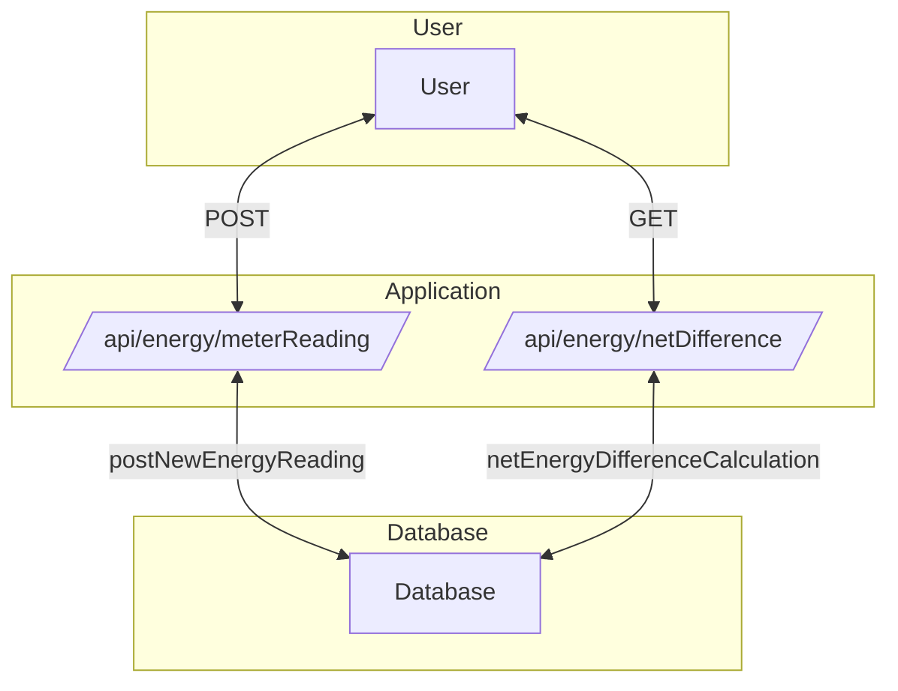

# CFG JAVA +MASTERS PROJECT 
## GREEN ENERGY MANAGER 
## GROUP 1:
## Team Members
- **[Amal Aden](https://github.com/logicology)**
- **[China Pickering](https://github.com/chinapicke)**
- **[Nadia Shetty](https://github.com/nashetty)**

### Table of Contents

- [Introduction](#introduction)
- [Links to further documentation](#Links-to-further-documentation)
- [API Endpoints](#api-endpoints)
- [Running Instructions](#running-instructions)
- [Project Structure](#project-structure)
- [Notes to Marker](#notes-to-marker)
- [Acknowledgments](#acknowledgments)


### Introduction

This project implements a RESTful API for managing and tracking energy transactions (used and produced). The API is developed using Spring Boot and provides endpoints to submit meter readings and calculate net energy differences for specified months.

### Links to Further Documentation

- [Project Requirements](./documentation/projectRequirements.md)
- [Manual Test Plan](./documentation/manualTestPlan.md)
- [CI/CD plan](./documentation/CI_CD.md)
- [Docker Instructions](./documentation/docker_instructions.md)

### API Endpoints

| Method | Path                          | Query Parameters | Body of Request                                                                                                                                                      | Result                            | Status Code | Response                                                                                             |
|--------|-------------------------------|------------------|----------------------------------------------------------------------------------------------------------------------------------------------------------------------|-----------------------------------|-------------|------------------------------------------------------------------------------------------------------|
| POST   | /api/energy/meterReading      |                  | {"transactionType": string(required), "energyType": string(required for GENERATED transactionType), "amountKW": number(required), "transactionDate": date(required)} | create new energy reading         | 200         | "New energy reading added" or error message                                                           |
| GET    | /api/energy/netDifference     | month=int        |                                                                                                                                                                      | calculate net energy difference   | 200         | {"netEnergyDifference": "Net Energy Difference for {month} is: {value} kWh"} or error message       |

> Note: The POST method requires `transactionType` to be either `GENERATED` or `USED`.

### Running Instructions

1. **Clone the repository:**

   ```bash
   git clone https://github.com/nashetty/Java-Masters-Final-Project-group-1.git
   cd Java-Masters-Final-Project-group-1
   ```
2. **Configure and seed the database:**  
   Ensure you have MySQL installed locally. Before running the project, you need to create the database and required
   tables by executing the `energy_manager.sql` script in MySQL Workbench or any other MySQL client of your choice. This file
   can be found in the `src/main/resources/database` folder of this project.  
   <br>
   Update the database configuration parameters in the application.yml file with your MySQL credentials.

   ```bash
   cd src/main/resources/
   touch application.yml
   ```
   ```yaml
   # application.yml
   spring:
      application:
        name: green-energy-manager
      datasource:
        url: jdbc:mysql://localhost:3306/energy_manager
        driver-class-name: com.mysql.cj.jdbc.Driver
        username: xxx
        password: xxx
   
   app:
      name: Green Energy Manager
      ```
> Note: You should never commit your application.yml file, as it contains sensitive information that should be kept
private.

3. **Open the project in IntelliJ and run `GreenEnergyManagerApplication.java`.**  


4. **Run tests:**   
   To run tests, please run test `EnergyControllerTest.java` from 
`src/test/java/com/codefirstgirls/green_energy_manager/controller`.


5. **Access API Documentation:**

   Open your web browser and navigate to:  
   http://localhost:8080/swagger-ui/index.html

   Here, you can explore all the API endpoints and test them using Swagger's interface.

### Project Structure

The project structure is as follows:
```bash
Green Energy Manager

green_energy_manager
│
├── .mvn/
├── documentation/
│   ├── manualTestPlan.md
│   ├── projectRequirements.md
│ 
├── src/
│   ├── main/
│   │    ├── java/
│   │    │    ├── com.codefirstgirls.green_energy_manager/
│   │    │          ├── controller/
│   │    │          │     ├── EnergyController.java
│   │    │          │ 
│   │    │          ├── model/
│   │    │          │     ├── entity/
│   │    │          │     │    ├── Energy.java
│   │    │          │          ├── TransactionType.java
│   │    │          │ 
│   │    │          ├── repository/
│   │    │          │     ├── EnergyRepository.java
│   │    │          │ 
│   │    │          ├── GreenEnergyManagerApplication.java
│   │    │ 
│   │    ├── resources/   
│   │         ├──database/
│   │         │   ├──energy_manager.sql
│   │         │
│   │         ├── application.yml.example    
│   │      
│   ├── test/java/com.codefirstgirls.green_energy_manager
│                   ├── controller/
│                   │     ├── EnergyControllerTest.java
├── .gitignore
├── README.md
├── pom.xml

```
**EnergyController:** This controller handles the endpoints for posting new energy readings and calculating the net 
energy difference for a specified month.

**Energy:** This entity represents the energy readings, including transaction type, energy type, amount, and transaction date.

**TransactionType:** This enum defines the types of transactions, either GENERATED or USED.

**EnergyRepository:** This repository interface extends JpaRepository and includes custom query methods for retrieving 
energy transaction data.


User interacts with Application through API calls (GET, POST).
Application interacts with Database to retrieve or store data (like retrieving the energy net difference or adding a new meter reading).

### Notes to Marker
The project focuses on the core functionalities of recording energy transactions and calculating net energy differences. 
Future improvements could include enhanced validation, additional utility methods, and further refactoring for better 
code organisation.

This project demonstrates the implementation of a RESTful API using Spring Boot and the usage of JpaRepository 
for database interactions.

Due to the project's small scale and time constraints, we prioritised development speed and simplicity over strict 
adherence to best practices. We understand that controllers should primarily handle HTTP requests and delegate
complex logic to service or utility components, which enhances code maintainability and readability. As the project 
scales, we will prioritise this separation to improve the overall structure and quality of the codebase.  


### Acknowledgments
Final project for the CFG +Masters Java Course, by Amal, China and Nadia

